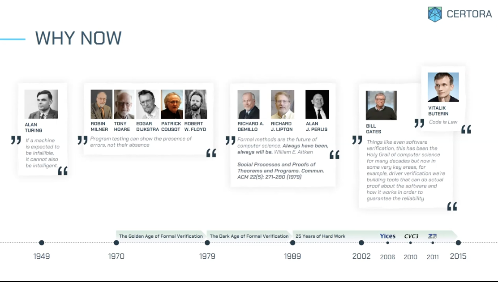
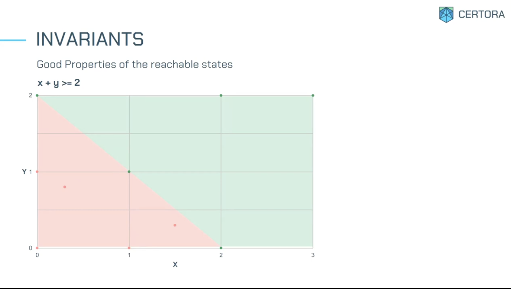

# Background

1. [Diffing](#diffing)
1. [Why now](#why-now)
1. [Formal Specification / Invariants](#formal-specs)
1. [Interesting Invariants DeFi](#interesting-invariants-defi)
1. [Bad invariants](#bad-invariants)
1. [Good invariants](#good-invariants)

## Diffing

To check different files we use the unix tool `diff`

**Formal verification** is like smart diffing.

We compare between the code with the specs

Formal verification can identify bugs.

## Why now

This is a science developed by computer scientists. Some people said it is difficult and it does not work but it did not stop people from working on it.

## Formal Specs

1. These represent the necessary parts of code documentation
1. Desired properties of the code
1. What the code is supposed to do not how

We think that auditors need to review the specifications

Some examples of specifications:

1. No double spend
1. Liquidation increases the amount of collateral
1. The order of deposits does not matter

This is useful for audition

Specification languages

1. TLA+
1. Assert and require (SMPTChecker)
1. Certora Verification Language (CVL)

## Interesting invariants DeFi

1. For every borrowed token there is sufficient collateral borrow
1. Sum of balances is equaal to the total amount
1. LiquidityShares > 0 ⇔ SystemHolding > 0
1. Each token has a unique entry (index in array)
1. Reward does not exceed max value

## Bad invariants

1. Too permisive

   1. X + 2 > X
   1. 2 \* X < X ⇒ 5 > 7

1. Too restrictive
   1. X = 3 ∨ X = 4

## Good invariants

Every execution of the contract starting in a state P results in a state Q

