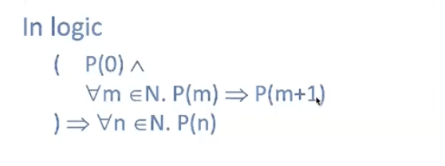
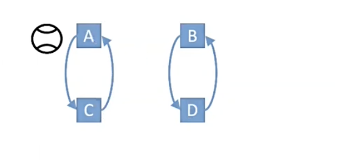

# Inductive Reasoning About Smart Contracts

> Notes are based on talk by James Wilcox from Certora and University of Washington. See video https://youtu.be/30BspXZs7q8

## Topics

1. [Proofs by induction](#proofs-by-induction)
   1. [Smart Contract induction](#smart-contract-induction)
1. [Transition systems and safety](#transition-systems-and-safety)
1. [Counterexamples to Induction](#counterexamples-to-induction)
1. [Strengthening Invariants](#strengthening-invariants)

> We are going to show that a property about your program might be true despite the fact that it might not be inductive, you will need to strengthen that property in order to proof it

## Proofs by Induction

We start with **Mathematical Induction** as familiar in a math class. This is just the idea that if you want to show that a property is true of all natural numbers `n`, then you can show it for zero and you can show that whenever it's true for a number `m` it's also true for `m + 1`

1. P(n) is a propert of natural number n
1. To prove P(n) for all n, show:
   1. P(0)
   1. Given m, if P(m) then P(m+1)

**To be philosophical why is it that mathematical induction works?**

**What is it about this technique that allows you to prove something about all numbers?**

If we draw a number line, so let's say we've got all of our numbers starting from 0 say we're trying to trying to prove that a point P(n) is true, if we want to get to a proof of P(n) then this these two steps prove it for zero and prove that if it's true for a number then it's true for the next number allows us to basically build up a proof of P(0) -> P(1) -> P(n), step by step so we can just use this almost like a program or an algorithm for computing a proof of p of n because we start by computing a proof of p of 0 using the base case and then we use the inductive case to transform that into a proof of p of 1 which we then transform into a proof of p of 2 and proof of p of 3 and so on all the way up until we get to whatever number we're looking at. So no matter what number we care about you know we can just iterate this second step that many times basically to get a proof of that fact and like this is pretty obvious and simple. You may have seen it before but i think there's actually something kind of deep happening here because we are proving an infinite number of facts with a finite amount of work. There are infinitely many non-negative integers and yet we're able to prove something about all of them by only doing two things.

### Smart contract induction

This is another kind of induction that's more closely related to program verification and smart contract reasoning

**Ball passing game**

Imagine this kind of silly game where people are passing the ball between each other. So we've got four players A, B, C and D and the rules of this game are fairly boring. The rules are that A always passes to C, C always passes to A and similarly B always passes to D and D always passes to B. There's basically these two groups and they just pass to each other and at the beginning let's say that A starts with the ball and we want to ask this question. Can the ball ever get to player D?

**Ans**: Never. So that's kind of obvious, but what if we wanted to show that formally? What if we wanted to prove that no matter how long we play this game the ball is never going to get to D?

## Transition Systems and Safety

## Counterexamples to Induction

## Strengthening Invariants
